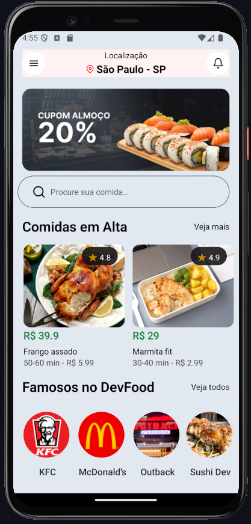
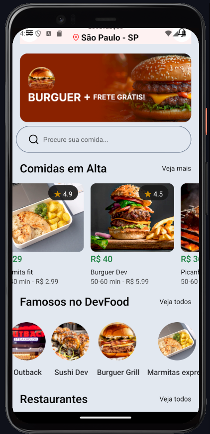
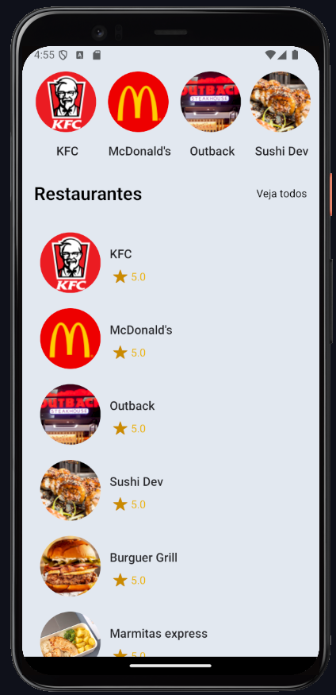

# Delivery App

This is the front-end of a mobile delivery application, developed to facilitate the delivery of orders quickly and intuitively.

## Description

The **Delivery App** allows users to order food directly from their cell phone. The goal is to offer a clean and simple interface, where the customer can browse different restaurants, choose menu items, customize the order and complete the purchase.

Project images: 
<div align="center">
   
   
   
</div>

## Features

- Home screen with list of restaurants
- Home screen with list of trending foods
- Home screen with list of famous foods


## Technologies Used

- **React Native** - Framework principal para desenvolvimento mobile
- **Typescript** - Linguagem de programação utilizada


## Instalation

For execute the project local, follow the steps bellow

1. Clone this repository:
   ```bash
   git clone https://github.com/Gabrielhdsalves/Delivery-App-Mobile.git
   ```
2. Enter the cloned directory
   ```bash
      cd Delivery-App-Mobile
   ```
3. Install the dependencies
   ```bash
     npm install
   ```
4. Start the API
   ```bash
      npx json-server db.json
   ```
5. Start the front
   ```bash
      npm start
   ```